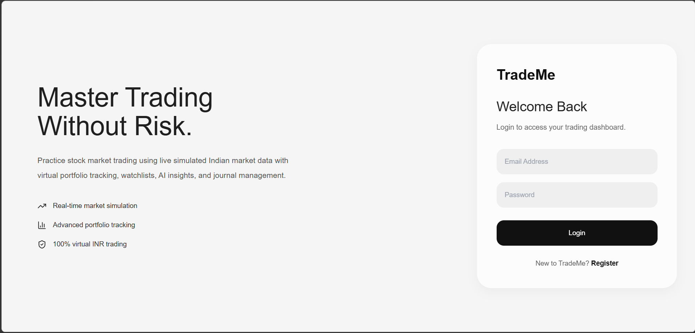
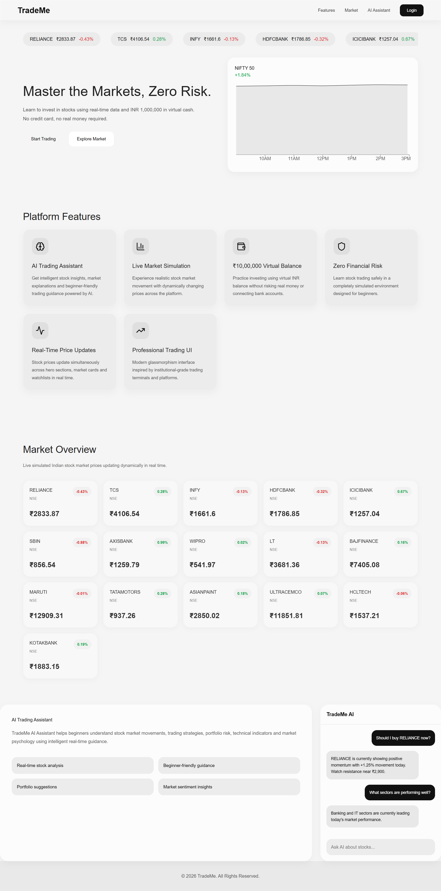
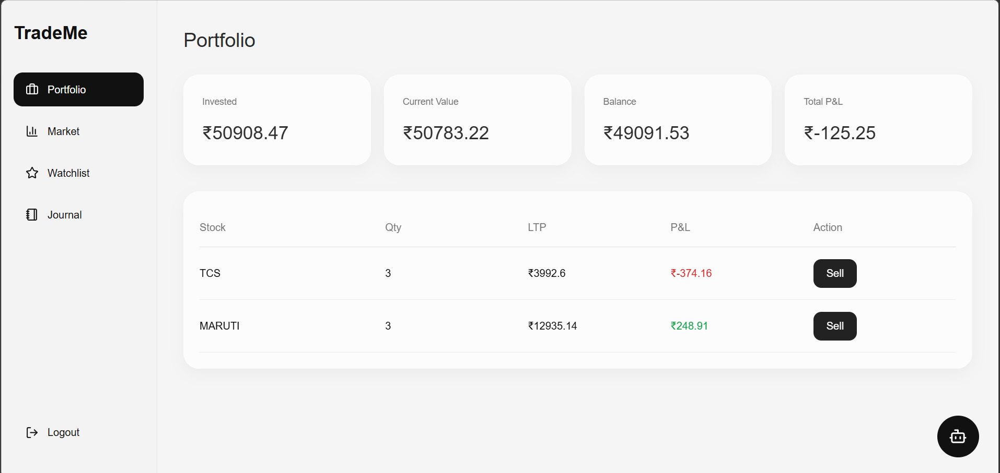

# TradeMe

TradeMe is a MERN-based stock trading platform that allows users to buy and sell stocks using virtual funds, manage their portfolio, maintain a watchlist, and track overall investment performance.

## Features

* User authentication
* Buy and sell stocks
* Portfolio management
* Watchlist
* Market dashboard
* AI assistant

## Tech Stack

* React.js
* Tailwind CSS
* Node.js
* Express.js
* MongoDB

## Installation

```bash
git clone https://github.com/pavanrane-7/TradeMe.git
cd TradeMe
npm install
npm start
```

## Screenshots

### Login Page


### Hero


### Portfolio



## Author
Pavan Rane
